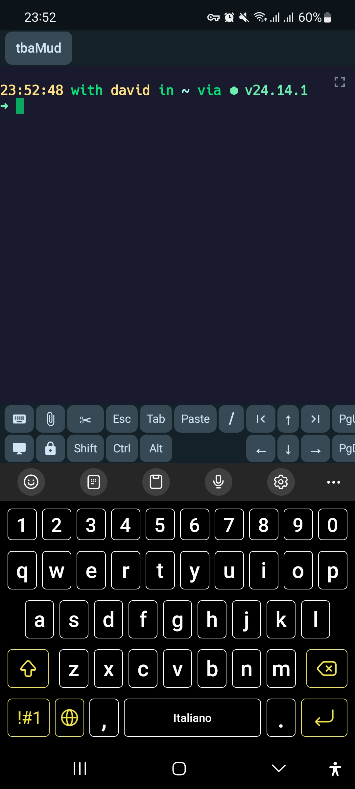
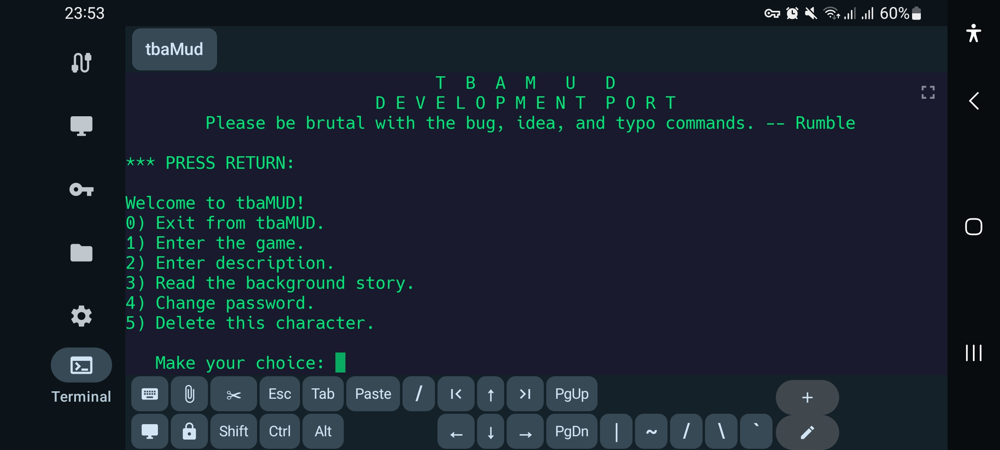
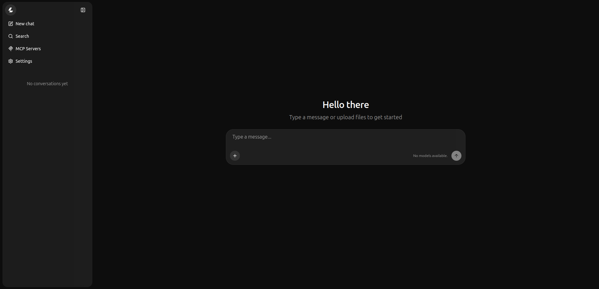
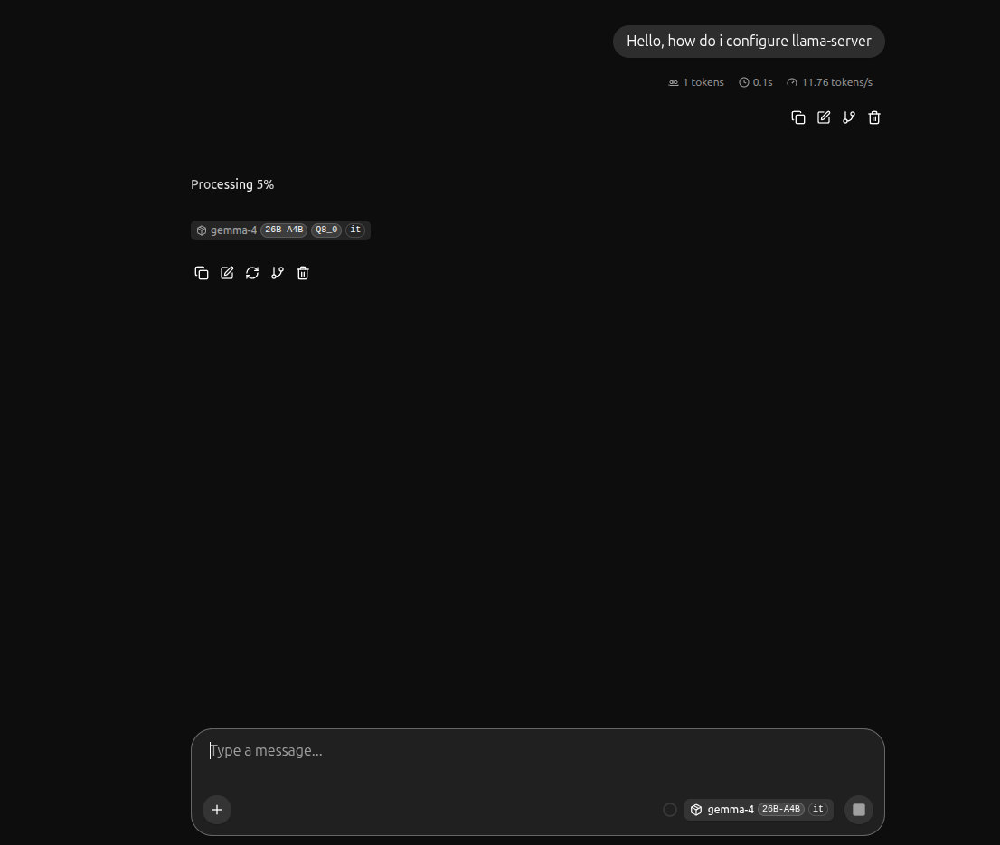
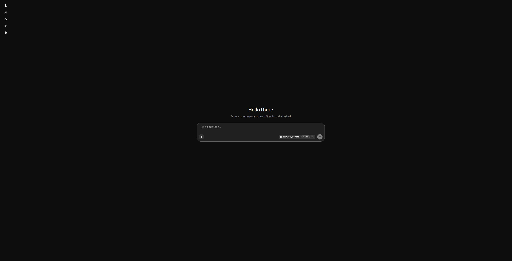
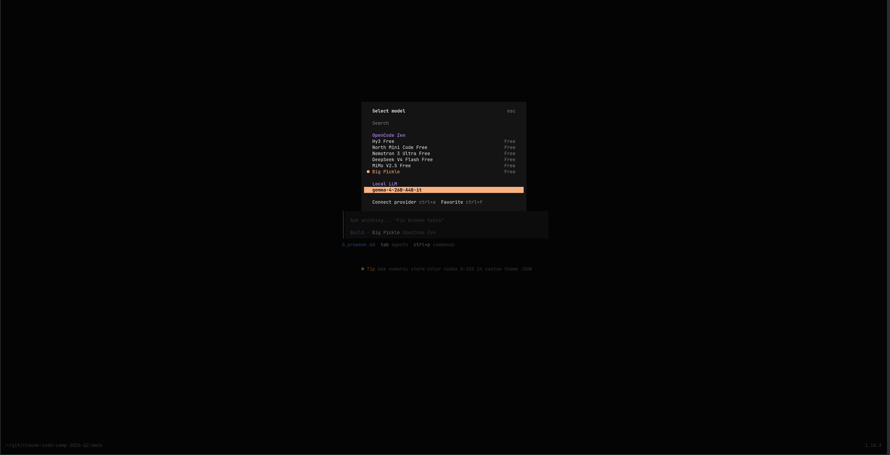
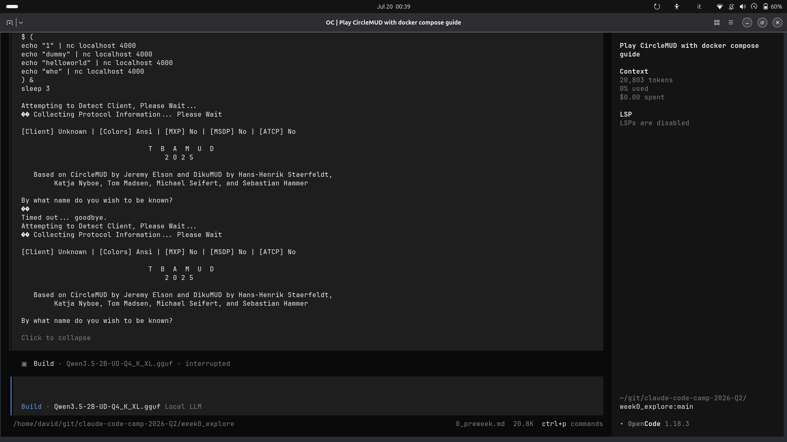
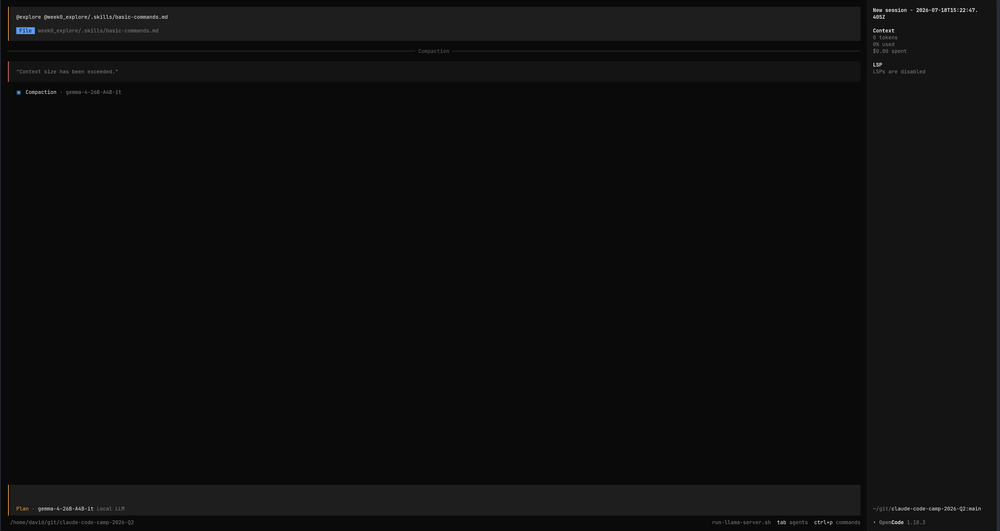

# Preweek Technical Documentation

## Technical Goal

- [ ] Build an agent with an sdk and after understanding how to implement it try to build my own agent without using one.
- [x] I want to experiment MUD by using my phone, by using Haven app (f-droid) create a connection and play the game
  - [ ] Next step is to use openclaw to use the game
- [x] Use open models to evaluate
  - [x] Use llama.cpp 
  - [x] Enhance open models on linux with [libopenblas-dev](https://github.com/OpenMathLib/OpenBLAS/tree/develop)
  - [x] Launch llama-server to provision model
  - [x] Learn to use an open agentic harness (eg. OpenCode)
  - [x] Launch local models with opencode
  - [x] Fixing context issue with opencode
  - [x] Reduce docker memory footprint on Linux
    - [x] Check for memory usage
  - [ ] like FinOps define a cost usage for all coding harness even those that are using open models by following this simple model: **request** | **token usage** | **time spent** |
## Technical Uncertainty

My own ability to implement it. Doing it with AI is easy but I want to make the most and delegate where I can.
After installing llama.cpp I went to look in HuggingFace for a model that would fit my needsd for tbaMUD. Apart from most popular models like Qwen 3.6 series and Gemma 4 series, I was looking for a specific model that would cater for my needs but I was not sure what fit my needs.
I have a lack of understanding of my hardware limits to run local llms and I am trying to figure them out one by one.

### Troubleshooting issue with local model
```zsh
Loading model... /1.06.595.834 E llama_init_from_model: failed to initialize the context: dflash requires ctx_other to be set (this warning is normal during memory fitting)
1.06.659.281 E common_fit_params: encountered an error while trying to fit params to free device memory: failed to create llama_context from model
|1.07.340.891 E llama_init_from_model: failed to initialize the context: dflash requires ctx_other to be set (this warning is normal during memory fitting)
1.07.340.897 E cmn  common_init_: failed to create context with model '/home/david/.cache/huggingface/hub/models--ggml-org--gemma-4-26B-A4B-it-GGUF/snapshots/3d3dca2094ff8112005fd10fc7a8e30cf4f45b56/dflash-gemma-4-26B-A4B-it-Q8_0.gguf'
[1]    27167 segmentation fault (core dumped)  /home/david/apps/llamacpp/llama.cpp/build/bin/llama-cli -hf
```

## Technical Hypotheses

With the time I have, the most realistic goal I can achieve is to implement the agent using a SDK and possibly complete the primary challenge.
## Technical Observerations

1. Technical goal **Build an agent with a SDK**:
2. Technical goal **Connect using phone to tbaMUD**:

Could not connect using phone because of the firewall? 
```zsh
sudo ufw allow 4000/tcp.
```
| Still not working, probably due to router network isolation. 

### Remove rule and create an ssh tunnel

```zsh
sudo ufw delete allow 4000/tcp
sudo ufw status verbose
```

### SSH
```zsh
sudo apt install openssh-server
```

| Check installation
```zsh
sudo systemctl status ssh
```
| Inactive

Reason for inactive: on modern linux ssh is often configured to run via a systemd socket, instead of ssh.service running constantly in the background.

### Starting the ssh and service

```zsh
sudo systemctl start ssh.socket
sudo systemctl start ssh.service
```

| Verify again
```zsh
sudo systemctl status ssh
```
### Succesful connection



### Connecting to tbaMud using phone




3. Technical goal **Use OpenClaw**:


4. Technical goal **Use open models**:
I had already installed llama.cpp to evaluate some local models.
To get started with open models it requires a lot of setup. Ollama would have been the easier and most immediate solution.

#### Running my local model from huggingface
```zsh
llama cli -hf ggml-org/gemma-4-26B-A4B-it-GGUF:Q8_0
```

#### Launch llama-server
```zsh
llama cli -hf ggml-org/gemma-4-26B-A4B-it-GGUF:Q8_0
```

```zsh
./build/bin/llama-server 
```


##### Running my model


#### Hitting my hardware limit
I have a RTX 3060 laptop who has only 6gb of VRAM and 26GB of RAM (with only 17GB available), therefore the model does not fit my hardware. I had to swap for a lighter model with CPU/GPU offloading.
```zsh
llama -hf ggml-org/gemma-4-26B-A4B-it-GGUF --hf-file gemma-4-26B-A4B-it-Q4_0.gguf-ngl 999
```
I need to remember to use always `--hf-file` to avoid ambiguity. Another thing I found out from this post [llama-cpp-n-gpu-layers-explained-2026](https://bmdpat.com/blog/llama-cpp-n-gpu-layers-explained-2026)
```txt
If your model fits entirely in VRAM: Use -ngl -1 or -ngl 999. Full offloading gives the best performance.
```
#### Speeding up token generation for local models using speculative decoding
[llama.cpp speculative decoding](https://github.com/ggml-org/llama.cpp/blob/master/docs/speculative.md).
I did not know what dflash models were. Uknowingly from troubleeshoting the error I found out I can use them with llama-server for
speculative decoding, something I am quite familiar within LM Studio.

| *llama-server invocation pairing target + draft:*
```zsh
 llama-server -hf ggml-org/gemma-4-26B-A4B-it-GGUF --hf-file gemma-4-26B-A4B-it-Q4_0.gguf -md /home/david/.cache/huggingface/hub/models--ggml-org--gemma-4-26B-A4B-it-GGU F/snapshots/3d3dca2094ff8112005fd10fc7a8e30cf4f45b56/dflash-gemma-4-26B-A4B-it-Q8_0.gguf --spec-type draft-dflash --spec-draft-n-max 15 -fa on
```


I have learned few things from his posts: [willschenk llama.cpp](https://willschenk.com/howto/2026/migrating_to_llama_cpp/)
[what is monitor tool in claude](https://claudelog.com/faqs/what-is-monitor-tool-in-claude-code/)

#### Troubleshooting llama cli issue
When launching 
```zsh
llama cli -hf ggml-org/gemma-4-26B-A4B-it-GGUF:Q8_0
```
I was downloading another model with the same tag *Q8_0* this is because the -hf file picker was excluding most extension like mmproj, imatrix and mtp- but not dflash.

##### Creating user preferences for opencode opencode.json and MASTER.md

### Improve local models on linux with explanation.

- BLAS libraries improve matrix multiplication performance on CPUs
- Accelerate inference with the help of the CUDA Toolkit

5. Technical goal **Choosing the right model from HuggingFace**:

I had an hard time choosing the category that would fit my needs.
There are many categories and the one I had a look into where:
- Text generation: specializes in generating text, It could fit my needs.
- Sentennce similarity: specializes in converting sentences to vector embeddings, It could fit my needs if I am not specific about what to do.
- Zero-Shot / Text Classification: specializes in evaluating, It could be useful to generate on the fly commands for my player that do not yet exist
- Token Classification: model that parse the sentence to identify a possible target.
- Text-to-Speech(TTS): could be fun to play around and create an immersive experience.

6. **Launch local models with opencode**

Running opencode with gemma4 on my machine 



7. Technical goal **Fixing context issue with opencode**:

In order to grasp the issue, I tried to look in the llama.cpp issue and found something that may be related to my issue. 
However, I did not know how to check the context size of a specific model. From this search and from what I have understood from the requirements I needed
a model that has a **large context size** and that has **thinking**. Gemma4 and Qwen 3.7 are capable of these.

#### Browsing HuggingFace

While browsing HF, I found out about the term **AgentWorld** while looking at QwenAgentWorld. I was not familiar with this terminology therefore I delved
and found out about **language world model (LWM)**. From my understanding It acts as a digital environment for other AI agents and this could be beneficial
for the possible solution.
I could use this type of model to enrich the planning and feed it to the agentic loop to improve results.

#### Hardware limitation

I have learned how to calculate which model I can run based on my HW and the model capabilities. I selected the correct model for my HW and now I can
play as much as I want with opencode at no cost.

#### Observation of running a local llm with low HW capabilities with a coding harness and a basic instruction.



I entered a never ending loop and the agent never managed to enter the actual game, even after explicitly tell him which where the commands to enter it.

I tried to ask the agent to write to a file my initial request and he generated a new folder with the request.

8. Technical goal **Reduce docker memory footprint on Linux**:

I removed docker-desktop and I am running docker engine to free 6gb of space.

To check for the memory usage I run
```zsh
free -h
```
To be more specific of which processes are eating the memory
```zsh
ps -eo pid,ppid,user,%mem,rss,comm, --sort=-rss | head -n 20 
```


Is this an hardware limitation? 



## Technical Conclusions

My initial goal got sidetracker by many other sub goals that I enjoyed doing. However this detour was more time consuming than expected. I did not meet some of my goals, the sdk agent, the from scratch agent because I invested too much time trying to run local models using OSS tools.
While pursuing this objective I got side tracker and hit many walls because of hardware limitations and one of this issue is still open, I am exceeding the context size when running opencode. 
The phone experiment was really fun, It was a smart way to keep playing the game while working. It was unplanned but an useful detour into SSH tunnelling and firewall/router isolation troubleshooting. I plan to still pursue in the next week openclaw.

## Key Takeaway

Local LLM tooling is powerful but hardware-gated. Most of this week's effort went into fitting models to my machine rather than building the agent itself, so next week I am going to try to be more time aware and focus on the main goal.